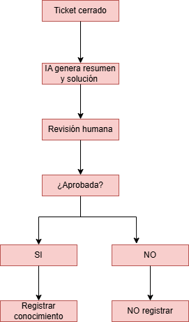
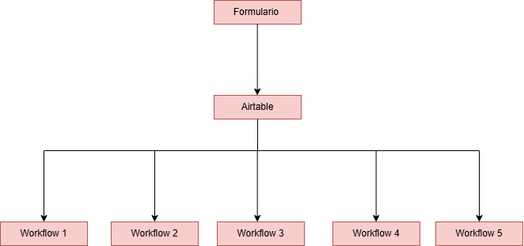
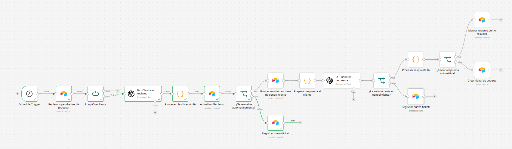
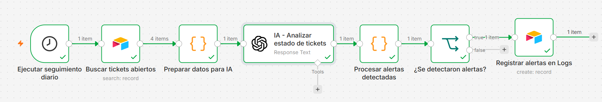
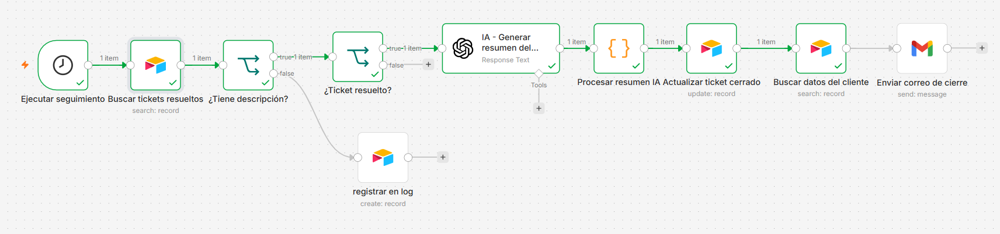
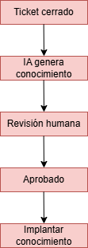
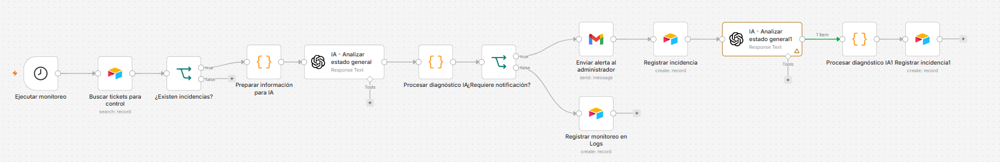
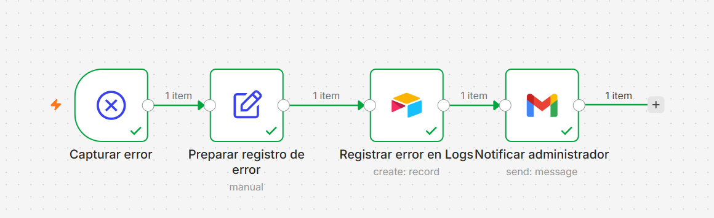

Link para la BD en Airtable
https://airtable.com/appkaRXVMcpVYv52B/shreRxlaa3BCFAiwH


Link para el video con demostración en drive:
https://drive.google.com/file/d/1e5vEcy5S-uxAESRkxKLJMh8pfBLWazNl/view?usp=sharing

Link para el documento con arquitectura:
https://drive.google.com/file/d/1cNgBJ8EwoXyvvd-QdRbCUzFmLMXvIjL6/view?usp=sharing

# Ecosistema Inteligente de Gestión de Reclamos

## Objetivo
Automatizar el ciclo completo de gestión de reclamos mediante Inteligencia Artificial, permitiendo resolver automáticamente consultas repetitivas, clasificar incidentes, gestionar tickets, asistir al personal responsable y generar métricas para la toma de decisiones.

El sistema busca:
- Reducir tiempos de respuesta
- Automatizar consultas frecuentes
- Conservar conocimiento histórico para mejorar la resolución futura de incidentes

## Requisitos / Alcance del sistema
- Automatizar la recepción de reclamos.
- Clasificar automáticamente cada incidente mediante IA.
- Buscar soluciones similares en una base de conocimiento.
- Resolver automáticamente los casos repetitivos.
- Crear tickets cuando sea necesaria la intervención humana.
- Asignar responsables según categoría y prioridad.
- Supervisar diariamente los tickets abiertos.
- Generar resúmenes inteligentes.
- Gestionar una base de conocimiento validada mediante Human-in-the-Loop.
- Generar indicadores para la toma de decisiones.

## Observaciones:

El sistema parte de la idea de que el usuario ingresa el reclamo que se va a grabar en la base de reclamos. Una vez que el reclamo está en la base comenzará el flujo automatizado. Como varios reclamos se pueden insertar incluso a la vez se implementa un trigger que corra cada cierta cantidad de tiempo para procesar los reclamos que no han sido procesados aún.
Para finalizar el flujo se crea una tabla Dashboard_IA donde se almacena la información para luego realizar los dashboards que se consideren necesarios con la información obtenida. La tabla Dashboard_IA no participa en la operación diaria del sistema. Su finalidad es consolidar indicadores generados por los workflows para facilitar el análisis del desempeño del ecosistema y apoyar la toma de decisiones. 


## Gestión del Conocimiento (Human-in-the-Loop)
Cuando un ticket se cierra:
- La IA genera un resumen de la resolución y recomendaciones.
- La incorporación de esa información a la tabla `Conocimiento` **no se realiza automáticamente**.
Se requiere validación de un responsable (Human-in-the-Loop) para asegurar:
- que la solución sea correcta
- que no esté duplicada
- que sea útil para futuros casos

### Panel de revisión (Human-in-the-Loop)
- Se muestra al responsable el conjunto de soluciones propuestas por la IA.
- El responsable puede: aprobar, rechazar o solicitar modificaciones.
- Incluye una acción para actualizar la tabla `Conocimiento`.
`Conocimiento` quedan planteados como una **mejora futura** del ecosistema.

La metodología Human-in-the-Loop también será aplicada en otros escenarios donde la intervención humana aporte valor, como la revisión de reclamos que no puedan ser resueltos automáticamente y la validación de casos críticos. Estos mecanismos forman parte del diseño del sistema y permiten mantener supervisión humana en decisiones donde la IA requiere apoyo o confirmación.
Ejemplo de aplicación de HITL:


## Diagrama general

## Arquitectura (Workflows coordinados + Airtable)
El ecosistema fue dividido en **cinco workflows independientes** que trabajan de forma coordinada sobre una misma base de datos en **Airtable**.  
Cada workflow tiene una responsabilidad específica dentro del proceso de gestión de reclamos, manteniendo una arquitectura modular, escalable y fácil de mantener.

### Tecnologías utilizadas
| Tecnología | Función |
|---|---|
| n8n | Orquestación del ecosistema |
| Airtable | Base de datos y memoria (estado, tickets y conocimiento) |
| OpenAI GPT-4o-mini | Clasificación y procesamiento mediante IA |
| Gmail | Comunicación con el cliente |
| GitHub | Publicación del proyecto |
| RAG | Recuperación de conocimiento |

### Enlace a la base de Airtable (lectura)
https://airtable.com/appkaRXVMcpVYv52B/shreRxlaa3BCFAiwH

## Arquitectura de base de datos (Airtable)
La base de datos en Airtable funciona como **memoria permanente** del ecosistema y está compuesta por las siguientes tablas:

### Tablas
#### Clientes
Guarda la información de los clientes que generan reclamos.
- **Nro_cliente** (PK)
- Nombre
- Email
- Teléfono
- Fecha_alta
- Observaciones

#### Reclamos
Representa el punto de entrada del sistema.
- **Nro_reclamo** (PK)
- Fecha_ingreso
- Cliente (FK)
- Asunto
- Descripción
- Estado
- Área
- Categoría
- Prioridad
- Resuelto_automaticamente
- Resolucion
- Ticket

#### Tickets
Contiene los incidentes que requieren intervención humana.
- **Nro_ticket** (PK)
- Reclamo (FK)
- Cliente (FK)
- Fecha_creacion
- Estado_ticket
- Responsable
- Área
- Prioridad
- Fecha_vencimiento
- Descripcion_problema
- Resolucion
- Tiempo_dedicado
- Resumen_IA
- Fecha_cierre
- Notificado_usuario
- Aprobado_por_encargado

#### Responsables
Registra el personal encargado de resolver los tickets.
- **Nro_responsable** (PK)
- Nombre
- Email
- Área
- Cargo
- Estado
- Ticket_asignados (FK)

#### Conocimiento (Base de conocimiento / RAG)
Almacena las soluciones reutilizables generadas por el sistema.
- **Nro_caso** (PK)
- 	Problema
- 	Solución
- 	Área
- 	Categoría
- 	Prioridad
- 	Fuente
- 	Fecha_registro


Almacena las soluciones reutilizables generadas por el sistema.
## Tablas adicionales (Logs y evidencias)
### Logs
Registra todos los errores ocurridos durante la ejecución del ecosistema.
- Nro_log (PK)
- Workflow
- Nodo
- Error
- Estado
- Resumen_de_control
- Cant_alertas
- Fecha_creacion

### Dashboard_IA
Tabla creada para consolidación y análisis de datos para dashboards e indicadores.
- Fecha
- Total_Tickets
- Tickets_Resueltos
- Tickets_Pendientes
- Tickets_Con_Alertas
- Tiempo_Promedio_Resolucion
- Categorías_Mas_Frecuentes
- Problemas_Recurrentes
- Riesgos_Detectados
- Recomendaciones_IA

## Arquitectura del flujo


## Descripción de los Workflows (alto nivel)

### Workflow 1 - Recepción inteligente de reclamos (cerebro del proyecto)

Se utiliza para automatizar la recepción y clasificación de un reclamo desde el momento en que ingresa al sistema.

#### Entradas / Trigger
- El reclamo se registra en un formulario web (no implementado en este entregable).
- En este entregable, se **simula** la recepción mediante el registro directo del reclamo en la tabla **Reclamos** de Airtable.
- Como existe posibilidad de múltiples reclamos simultáneos, el workflow inicia con un **trigger** que revisa cada cierto tiempo la base buscando reclamos nuevos/pedientes de procesar (para la demo se usaron intervalos cortos).

#### Procesamiento con IA
1. Busca nuevos reclamos pendientes de procesar.
2. Envía la descripción a **GPT-4o-mini**.
3. Clasifica el reclamo determinando:
   - categoría
   - área
   - prioridad
4. Evalúa si el caso puede resolverse automáticamente.

#### Decisiones
- **Si se puede resolver automáticamente:**
  - Ejecuta **RAG (recuperación de conocimiento)** consultando la tabla **Conocimiento** en Airtable.
  - Recupera soluciones similares previamente registradas.
  - Si encuentra una solución válida:
    - registra la resolución automática,
    - actualiza el reclamo,
    - finaliza el proceso.

- **Si no se puede resolver automáticamente o no hay solución válida en Conocimiento:**
  - crea un **ticket**,
  - asigna un **responsable**,
  - deja el caso pendiente de resolución.

#### Resultado
Este workflow reduce el tiempo de atención de consultas repetitivas reutilizando conocimiento (RAG) y automatizando la resolución cuando aplica.

## Prompts utilizados

### Prompt para clasificar reclamos
**Rol:** Eres un asistente experto en gestión de reclamos empresariales.  
**Objetivo:** Analizar un reclamo y determinar su clasificación y si puede resolverse automáticamente.  
**Genera:**
- Categoría del reclamo
- Prioridad
- Área responsable
- Resolución automática (SI/NO)

**Reglas:**
- Utilizar únicamente los valores definidos para cada campo.
- Responder:
  - **SI** cuando exista una solución estándar disponible.
  - **NO** cuando requiera análisis manual, intervención técnica o seguimiento.
- No agregar información adicional.

**Devuelve JSON:**
```json
{
  "categoria": "",
  "prioridad": "",
  "area": "",
  "resolucion_automatica": ""
}
```
### Prompt para recuperación de conocimiento (RAG)
**Rol:** Eres un sistema experto de recuperación de conocimiento.
**Objetivo:** Comparar un nuevo reclamo con casos almacenados para identificar soluciones existentes.
**Genera:**
Si existe un caso similar
Solución asociada al caso encontrado
**Reglas:**
Considerar únicamente casos donde la solución pueda aplicarse.
No inventar soluciones.
Responder únicamente en formato JSON.
**Devuelve JSON:**
```json
{
  "encontrado": true,
  "solucion": ""
}
```

### Workflow 2 - Seguimiento diario y alertas

Se utiliza para supervisar diariamente todos los tickets abiertos e identificar situaciones que requieran intervención humana. Las alertas generadas por la IA no ejecutan acciones automáticamente, por lo que incorpora un punto de Human-in-the-Loop: un responsable revisa cada caso y decide qué acciones tomar (reasignación, prioridad o seguimiento).

### Entradas / Trigger
Schedule Trigger: ejecución programada una vez por día (en pruebas se ajusta el tiempo para acelerar la demostración).
#### Procesamiento con IA
1.Consulta todos los tickets abiertos.
2.Identifica tickets próximos al vencimiento.
3.Detecta tickets vencidos.
4.Verifica responsables inactivos.
5.Identifica prioridades críticas.
6.Genera alertas para responsables.
7.Propone reasignación cuando corresponda.
8.Resultado esperado
9.Evitar incidentes olvidados o sin seguimiento mediante revisión periódica de:
####Evalua 
- Responsables
- Prioridades
- Vencimientos
- Tickets atrasados
- Reasignación
### Prompt para monitoreo y detección de alertas en tickets
**Rol:** Eres un asistente inteligente de gestión de tickets.
**Objetivo:** Analizar el estado de los tickets e identificar situaciones que afecten su resolución.
**Genera (alertas):**

- Tickets vencidos o próximos a vencer
- Tickets sin responsable asignado
- Tickets con prioridad alta demorados
- Tickets pendientes de respuesta
- Posibles reasignaciones/problemas de tiempos
**Reglas:**
- Utilizar únicamente la información proporcionada.
- No inventar datos.
- Analizar estado, prioridad, responsable, área, vencimiento e historial.
- Responder únicamente en formato JSON.
**Devuelve JSON:**

```json
{
  "alertas_detectadas": [
    {
      "nro_ticket": "",
      "tipo_alerta": "",
      "prioridad": "",
      "responsable_actual": "",
      "accion_recomendada": ""
    }
  ],
  "resumen_general": "",
  "cantidad_alertas": 0
}
```

### Workflow 3 - Cierre de ticket y generación de conocimiento

Este workflow se ejecuta cuando un ticket cambia al estado **“Cerrado”**. Su objetivo es documentar la resolución del caso y generar **conocimiento reutilizable** mediante inteligencia artificial.

#### Trigger
- Se ejecuta mediante búsqueda periódica (intervalos cortos para la demostración; en entorno real podría ser cada 10 minutos).

#### Durante su ejecución
- Se detecta el cierre del ticket.
- La IA analiza la resolución registrada por el responsable.
- Genera:
  - resumen del problema
  - solución aplicada
  - recomendación para casos futuros
- Se actualiza la información del ticket con el resumen generado.
- Se envía al cliente un correo electrónico notificando el cierre del caso.

#### Human-in-the-Loop (validación antes de conocer)
La incorporación de la solución a la tabla **Conocimiento** **no** se realiza automáticamente.
Las propuestas quedan sujetas a validación **Human-in-the-Loop**:
- un responsable revisa y aprueba las soluciones
- solo las aprobadas se incorporan a la base de conocimiento
  



### Workflow 4 - Control y Monitoreo del Sistema

Este workflow se ejecuta de forma programada para **consolidar información** generada por el ecosistema y producir **indicadores** de seguimiento de la operación.

#### Trigger
- Se ejecuta periódicamente (en demostración se configuró con intervalo menor; en entorno real podría ser una vez por día).

#### Durante su ejecución
- Recopila información de reclamos y tickets procesados.
- La IA analiza el estado general del sistema.
- Si requiere notificación:
  - informa (si no, registra el log)
- Genera métricas, alertas y recomendaciones.
- Almacena resultados en la tabla **Dashboard_IA**.
- Proporciona información para la toma de decisiones.


### Workflow 5 - Gestión de errores y resiliencia

Este workflow se ejecuta automáticamente cuando ocurre un **error** durante la ejecución de alguno de los procesos del ecosistema.

#### Trigger
- **Error Trigger**: se activa cuando un workflow genera una excepción (en la demo se simuló con un error de prueba).

#### Durante su ejecución
- Detecta errores ocurridos durante la ejecución.
- Identifica el **workflow** y el **nodo** donde ocurrió el incidente.
- Registra la información del error en la tabla **Logs**.
- Notifica al administrador mediante correo electrónico.
- Mantiene trazabilidad de incidentes para mejorar la resiliencia del ecosistema.

## Optimización de Costos
| Proceso | Herramienta | Justificación |
|---|---|---|
| Clasificación | GPT-4o-mini | Bajo costo y excelente rendimiento |
| Búsqueda de soluciones | Airtable + RAG | Evita llamadas innecesarias a IA |
| Seguimiento | n8n | Automatización sin intervención humana |
| Notificaciones | Gmail | Integración simple y sin costos adicionales |

Observaciones:
- GPT-4o-mini se seleccionó por bajo costo para tareas repetitivas.
- El uso de RAG disminuye consultas innecesarias al modelo reutilizando soluciones existentes.
- Solo los casos nuevos requieren procesamiento completo por IA, optimizando tokens y costo operativo.
- Debido al tamaño del proyecto y al volumen esperado, no fue necesaria Batch API ni modelos especializados.

## Seguridad y Resiliencia
- Uso mínimo de datos personales.
- Almacenamiento centralizado.
- Manejo de errores.
- Logs.
- Reintentos.
- Human-in-the-Loop.
- Validación antes del envío al cliente.
- Separación entre datos operativos y conocimiento.

Observación:
- Las credenciales utilizadas por n8n se gestionan mediante credenciales seguras del propio sistema y no se almacenan dentro de los workflows.

## Dashboard Ejecutivo
Airtable permite visualizar:
- reclamos abiertos y reclamos cerrados
- porcentaje resuelto automáticamente
- tickets por responsable
- categorías más frecuentes
- prioridades
- errores registrados

## Conclusiones
El ecosistema desarrollado demuestra cómo la integración de herramientas No-Code/Low-Code con inteligencia artificial permite automatizar procesos empresariales de principio a fin.
La solución:
- reduce tiempos de respuesta
- mejora la organización de reclamos
- conserva el conocimiento generado
- incluye control, seguridad y validación humana para asegurar confiabilidad
- mantiene una arquitectura modular para futuras ampliaciones (nuevos canales de entrada o modelos de IA más avanzados).


